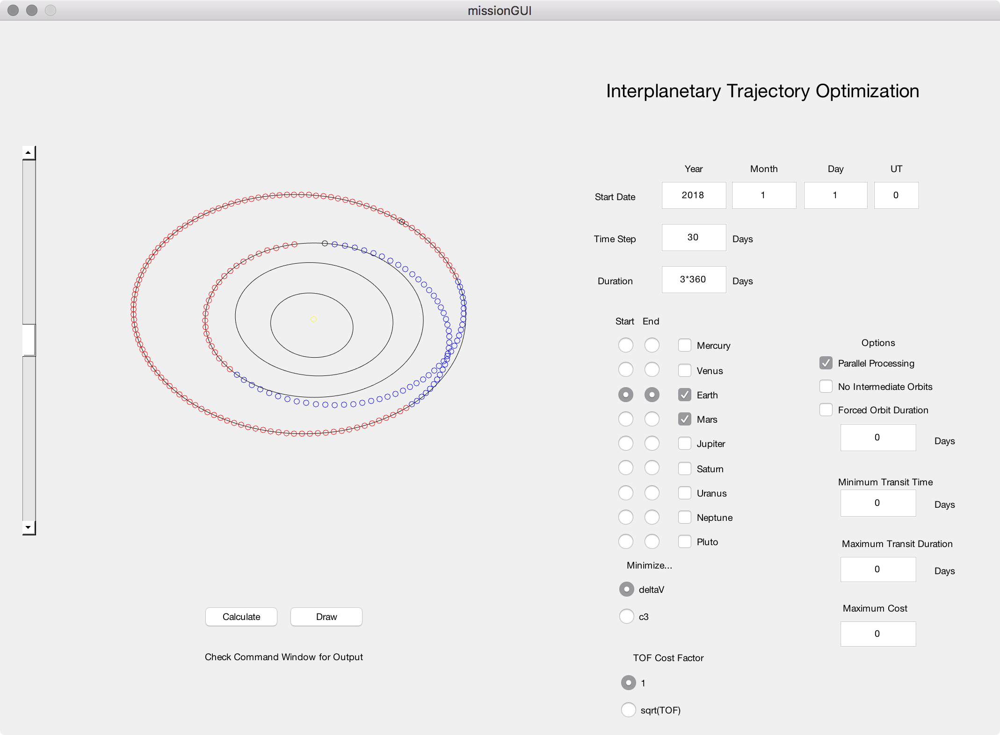

# mission-design
MATLAB tool that designs an interplanetary mission given a set of constraints.  Updated and tested on R2016b

~~Original paper: [A Novel Application of Binary Integer Programming](http://ccar.colorado.edu/ASEN5050/projects/projects_2014/Klein_Patrick/BIP.pdf)~~

~~Website: [Interplanetary Trajectory Optimization](http://ccar.colorado.edu/ASEN5050/projects/projects_2014/Klein_Patrick/index.html)~~

## How to Run

1. Run `missionGUI` from the command line.
2. Adjust the parameters, or keep the defaults.
3. Click "Calculate", and wait for optimization to complete.
4. After optimization is complete, click "Draw" to see the mission animation.


## Sample Window and Output:



```
~~~~~~~~Travelling Spacecraft Problem~~~~~~~~

Start:		Earth
End:		Earth
Visiting:	Mars

Start Date:	1/1/2018
Duration:	1080 days (2.96 years)
Time Step:	30 days

      parallelOpt: 1
    noIntOrbitOpt: 0
    maxTransitOpt: 0
         dtOption: 1
          maxCost: 0
         c3Option: 0

~~~~~~~~~~~~~~~~~~~~~~~~~~~~~~~~~~~~~~~~~~~~~

Total number of variables: 2664
Estimated number of deltaV calculations: 1332
Calculating cost vector...
Calculations finished.
Elapsed time is 2.976715 seconds.
Reduced number of variables: 2069

Optimization started.
LP:                Optimal objective value is 12.703566.                                            


Optimal solution found.

Intlinprog stopped at the root node because the objective value is within a gap tolerance of the optimal value, options.AbsoluteGapTolerance = 0 (the default value). The
intcon variables are integer within tolerance, options.IntegerTolerance = 1e-05 (the default value).

Elapsed time is 0.025516 seconds.

Orbit Earth from 1/1/2018 until 5/1/2018.
Transit from Earth to Mars from 5/1/2018 until 11/27/2018.
Orbit Mars from 11/27/2018 until 6/19/2020.
Transit from Mars to Earth from 6/19/2020 until 12/16/2020.

Total cost: 12.7036
```
